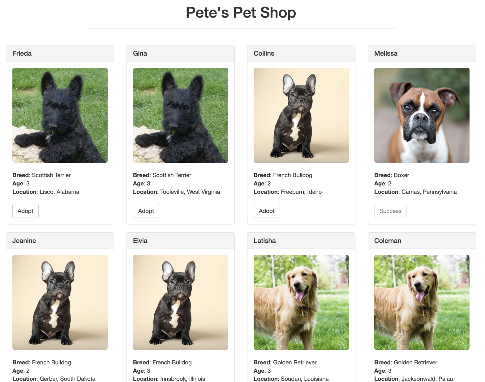
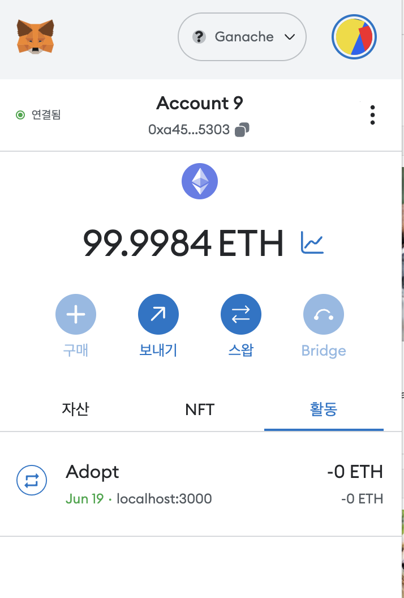

## 펫샵 튜토리얼 (Truffle을 이용한)

이 튜토리얼은 Truffle 프레임워크를 사용하여 펫샵 스마트 계약을 개발하고 배포하는 과정을 담고있습니다.

### 프로젝트 구조

```
- contracts/ : 스마트 계약의 솔리디티 소스 파일을 포함합니다.
- migrations/ : 스마트 계약 배포를 다루기 위한 마이그레이션 스크립트가 위치합니다.
- test/ : 스마트 계약의 자바스크립트 및 솔리디티 테스트 파일이 포함됩니다.
- truffle-config.js : Truffle 프로젝트의 구성 파일로, 네트워크 설정과 컴파일러 설정을 관리합니다.
```

### 주요 개념 및 키워드

- `pragma` : 컴파일러에게 추가 정보를 전달하는 지시어입니다.
- `Address` 타입 : 20바이트의 이더리움 주소를 나타내는 데이터 타입입니다.
- 함수 매개변수 및 반환 값 타입 : Solidity에서는 함수의 매개변수와 반환 값의 타입을 명시해야 합니다.
- `msg.sender` : 함수를 호출한 주체(사용자 또는 스마트 계약)의 주소를 나타냅니다.
- `address[16] memory` : `memory` 키워드를 사용하여 데이터를 실행 중에 임시로 저장하는 메모리 데이터 위치를 지정합니다.
- `view` : 상태를 변경하지 않고 계약 정보를 조회하는 함수를 나타냅니다.
- 컴파일 : Solidity 소스 코드를 EVM이 실행할 수 있는 바이트코드로 변환하는 과정입니다.
- 마이그레이션 : 스마트 계약 배포를 위한 스크립트로, 애플리케이션의 계약 상태를 변경합니다.

### 사용법

1. 저장소를 클론합니다.
2. Truffle 설치 및 프로젝트 의존성 설치를 위해 터미널에서 `npm install -g truffle` 명령어를 실행합니다.
3. 프로젝트 디렉토리로 이동한 후, `truffle unbox pet-shop` 명령어를 실행하여 기본 펫샵 튜토리얼 프로젝트 구조를 가져옵니다.
4. 스마트 계약을 개발하고 배포하기 전에, 솔리디티 소스 파일을 `contracts/` 디렉토리에 작성합니다.
5. 마이그레이션 스크립트를 `migrations/` 디렉토리에 작성하여 스마트 계약 배포를 관리합니다.
6. 테스트 파일을 `test/` 디렉토리에 작성하여 스마트 계약의 동작을 테스트합니다.
7. `truffle compile` 명령어로 솔리디티 소스 코드를 컴파일합니다.
8. `truffle migrate` 명령어로 스마트 계약을 배포합니다.
9. `truffle test` 명령어로 테스트 파일을 실행하여 스마트 계약의 동작을 검증합니다.


위의 내용은 Truffle 프레임워크를 사용하여 스마트 계약을 개발하고 배포하는 과정을 안내하는 펫샵 튜토리얼입니다. 자세한 내용은 프로젝트 내의 소스 코드와 Truffle 공식 문서를 참고해 주세요.

---
### 메타마스크와 연결하기
- 메타마스크를 실행한 뒤 계정 가져오기를 통해 가나시에서 제공하는 계정을 사용합니다.
- `lite-server`: 라이트 서버 라이브러리를 사용하여 확인할 수 있습니다.
- `bs-config.json`: baseDir : [웹사이트 파일, 컨트랙 artifacts]





---

## Truffle 테스트 스크립트 작성하기 (JavaScript)

이 문서는 Truffle을 사용하여 JavaScript를 이용해 스마트 컨트랙트를 테스트하는 방법에 대해 안내합니다.

### 1. Truffle 프로젝트 초기화

먼저, Truffle 프로젝트를 초기화해야 합니다. 다음 명령을 실행하여 Truffle 프로젝트를 생성합니다:

```
truffle init
```

### 2. 스마트 컨트랙트 및 테스트 스크립트 작성

1. `contracts` 디렉토리에 스마트 컨트랙트 파일을 작성합니다.
2. `test` 디렉토리에 테스트 스크립트 파일을 작성합니다. 테스트 스크립트 파일은 `*.test.js` 형식으로 저장해야 합니다.

다음은 `SimpleStorage.sol`이라는 간단한 스마트 컨트랙트를 테스트하는 테스트 스크립트의 예입니다:

```javascript
// test/SimpleStorage.test.js

const SimpleStorage = artifacts.require("SimpleStorage");

contract("SimpleStorage", (accounts) => {
  it("should set the data correctly", async () => {
    const simpleStorageInstance = await SimpleStorage.deployed();

    // 데이터를 설정하고 가져온 다음 검증하는 예제
    await simpleStorageInstance.set(42);
    const storedData = await simpleStorageInstance.get();
    assert.equal(storedData, 42, "The data was not set correctly");
  });
});
```

### 3. 테스트 실행

터미널에서 다음 명령을 실행하여 테스트를 실행합니다:

```bash
truffle test
```

이 명령은 `test` 디렉토리에 있는 모든 테스트 스크립트를 실행하고 결과를 터미널에 표시합니다.

`it`과 `before`는 Mocha라는 테스트 프레임워크의 함수입니다. Truffle은 Mocha를 기반으로 테스트 스크립트를 작성할 수 있도록 지원합니다.

- `it`: `it` 함수는 테스트 케이스를 정의하는 함수입니다. `it` 함수는 테스트의 설명 문자열과 테스트를 실행하는 콜백 함수를 인자로 받습니다. 테스트 케이스는 이 콜백 함수 안에서 구현되며, 테스트 결과에 대한 단언문(assertion)을 사용하여 예상 동작을 검증할 수 있습니다.

- `before`: `before` 함수는 테스트 케이스 실행 이전에 한 번 실행되는 함수입니다. 일반적으로 `before` 함수 내에서는 테스트 환경을 설정하는 작업을 수행합니다. 예를 들어, 스마트 컨트랙트 인스턴스를 배포하거나 초기 상태를 설정하는 등의 작업을 `before` 함수 내에서 수행할 수 있습니다.

Mocha는 테스트 스크립트의 실행 흐름을 제어하기 위해 다양한 훅(hook) 함수를 제공합니다. `beforeEach`, `after`, `afterEach` 등의 훅 함수를 사용하여 테스트 실행 전후에 특정 작업을 수행할 수도 있습니다.

Truffle에서는 Mocha의 `it`과 `before` 함수를 사용하여 스마트 컨트랙트의 테스트를 구성할 수 있으며, 해당 테스트 스크립트를 `truffle test` 명령을 통해 실행할 수 있습니다.

**참고 자료:**
- [Truffle 공식 문서](https://www.trufflesuite.com/docs)